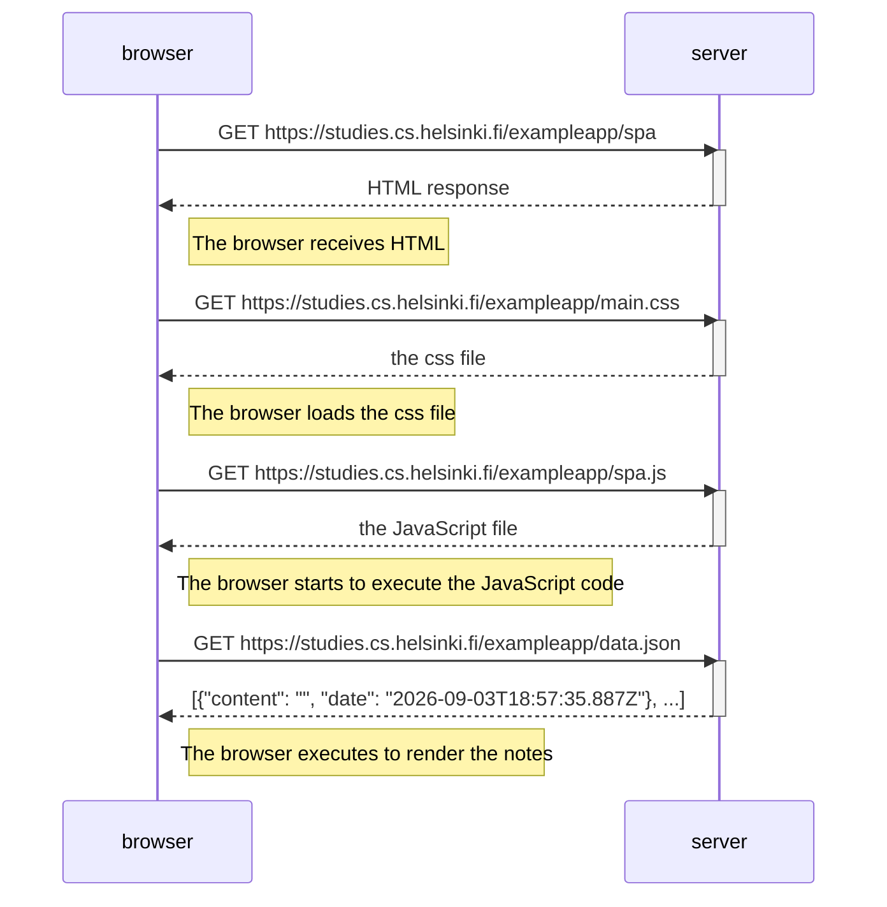

```mermaid
sequenceDiagram
  participant browser
  participant server

  browser->>server: GET https://studies.cs.helsinki.fi/exampleapp/spa
  activate server
  server-->>browser: HTML response
  deactivate server

  Note right of browser: The browser receives HTML

  browser->>server: GET https://studies.cs.helsinki.fi/exampleapp/main.css
  activate server
  server-->>browser: the css file
  deactivate server

  Note right of browser: The browser loads the css file

  browser->>server: GET https://studies.cs.helsinki.fi/exampleapp/spa.js
  activate server
  server-->>browser: the JavaScript file
  deactivate server

  Note right of browser: The browser starts to execute the JavaScript code

  browser->>server: GET https://studies.cs.helsinki.fi/exampleapp/data.json
  activate server
  server-->>browser: [{"content": "", "date": "2026-09-03T18:57:35.887Z"}, ...]
  deactivate server

  Note right of browser: The browser executes to render the notes
```
