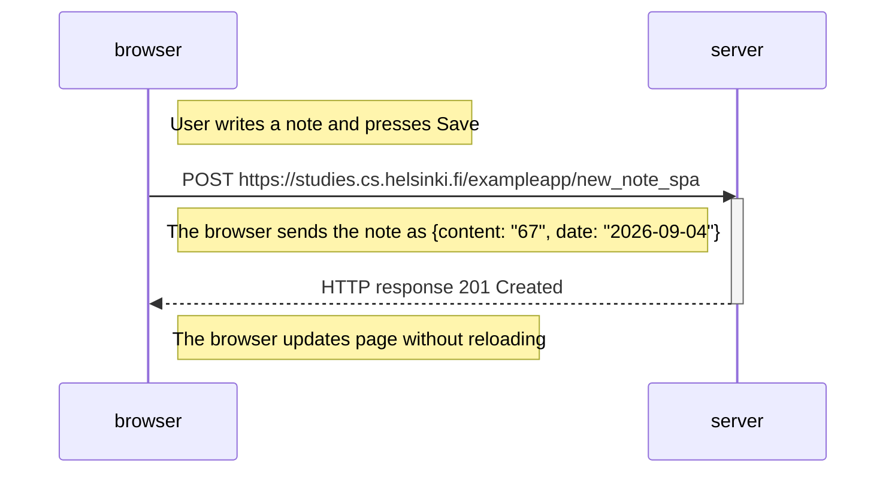

```mermaid
sequenceDiagram
  participant browser
  participant server

  Note right of browser: User writes a note and presses Save

  browser->>server: POST https://studies.cs.helsinki.fi/exampleapp/new_note_spa
  activate server
  Note right of browser: The browser sends the note as {content: "67", date: "2026-09-04"}
  server-->>browser: HTTP response 201 Created
  deactivate server

  Note right of browser: The browser updates page without reloading
```
